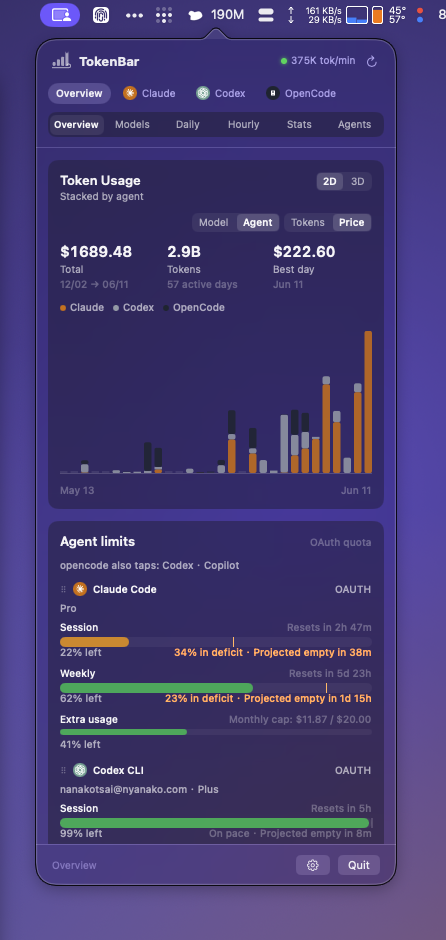
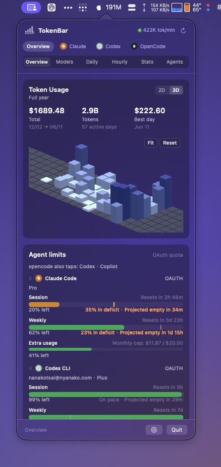
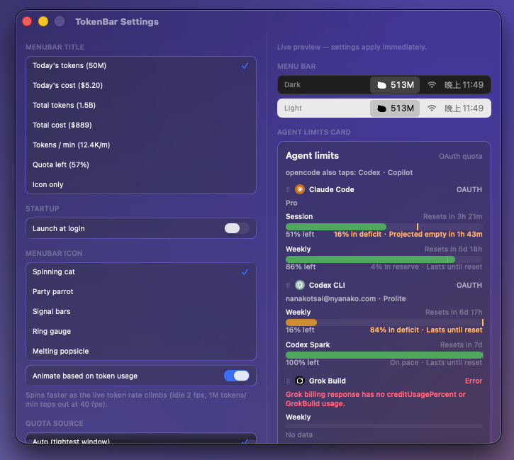

<h1 align="center">TokenBar</h1>

<p align="center">
  <strong>AI token usage &amp; quota monitor for the macOS menu bar — native Swift, Liquid Glass.</strong>
</p>

<p align="center">
  
  
  
  
  
  
</p>

<br>

**TokenBar** sits in your menu bar and shows what you're spending across
**25+ AI coding agents** — Claude Code, Codex, Cursor, OpenCode, Gemini CLI and
more — read on-device from your local session logs. No Dock icon, no telemetry,
no account.

<p align="center">
  
</p>

The menu-bar title shows today's tokens, cost, live tokens/min, or **how much
subscription quota is left** — as signal bars, a ring, or a popsicle that melts
as your window drains. And the **cat sprints faster the more you burn**, tracing
back to [RunCat](https://kyome.io/runcat/) by Takuto Nakamura.

---

## The dashboard

Click the icon and a Liquid Glass popover opens. A row of **app tabs** filters
_which_ agents you're looking at; a **view switch** picks _how_ that data is
broken down — seven lenses, plus the same year of usage as an orbitable 3D graph.

<p align="center">
  
</p>

<table>
  <tr>
    <td align="center" width="50%"><br><sub><b>Models</b> — every model ranked by cost</sub></td>
    <td align="center" width="50%"><br><sub><b>Daily</b> — active days, with day drill-down</sub></td>
  </tr>
  <tr>
    <td align="center" width="50%"><br><sub><b>Hourly</b> — when in the day you burn tokens</sub></td>
    <td align="center" width="50%"><br><sub><b>Stats</b> — headline summary &amp; streaks</sub></td>
  </tr>
  <tr>
    <td align="center" width="50%"><br><sub><b>Agents</b> — sub-agents ranked by cost</sub></td>
    <td align="center" width="50%"><br><sub><b>Settings</b> — menu-bar title, icon &amp; quota source</sub></td>
  </tr>
</table>

Plus **OAuth quota cards** with pace projections, a live session trace, streaks,
and full keyboard control (⌘1–9 tabs, ⌘G chart toggle, ⌘, settings). A failed
refresh never blanks a reading — the last known value stays until a fresh one
lands.

## Install

```sh
brew install --cask nanako0129/tokenbar/tokenbar
```

In-app updates arrive via Sparkle; betas ride an opt-in channel
(Settings → "Receive beta updates"). The app is ad-hoc signed (not notarized) —
the cask clears the quarantine attribute on install, as disclosed. Requires an
Apple Silicon Mac on macOS 14+ (Liquid Glass needs macOS 26; earlier systems get
a vibrancy fallback). Still on macOS 11–13? The final Tauri build stays as
[`tokenbar@legacy`](https://github.com/Nanako0129/TokenBar-Tauri).

## How it works

Rust owns the data — session parsing, aggregation, pricing, quota fetching — via
the vendored [tokscale-core](https://github.com/junhoyeo/tokscale), exposed to
Swift as a C-ABI staticlib (`crates/tb_core_ffi`). Swift owns the rest: SwiftUI
views, the `NSStatusItem` shell, Sparkle updates.

```sh
make                        # cargo build --release, then swift build
make run                    # build + launch TokenBar
swift run TokenBar --smoke  # run the FFI smoke test
```

The [project knowledge base](docs/knowledge/README.md) is the canonical guide to the Rust-to-Swift architecture, verification gates, vendor boundary, release chain, and maintenance state.

> Run `swift build` from the repo root — the linker's `-L target/release` path
> in `Package.swift` is relative.

## Contributing

See [CONTRIBUTING.md](CONTRIBUTING.md) for setup, change-specific guardrails, verification, and pull-request requirements.

## Credits

TokenBar is built on **[tokscale](https://github.com/junhoyeo/tokscale)** by
Junho Yeo. Its vendored `tokscale-core` crate does the session parsing, dedup,
and pricing across 25+ agents — and its interactive TUI is the blueprint for the
whole dashboard: the seven lenses (Overview, Models, Monthly, Daily, Hourly, Stats, Agents)
and their `In · Out · CR · CW` column breakdown are modeled on it.

The product line began as a fork of
[tokcat](https://github.com/handlecusion/tokcat) by handlecusion — the original
Tauri menu-bar monitor (itself built on tokscale). This native app is a
ground-up Swift rewrite that carries no tokcat code, but the menu-bar form and
the spinning-cat signature are theirs; the cat traces back to
[RunCat](https://kyome.io/runcat/) by Takuto Nakamura. The quota-pace cards
reference [CodexBar](https://github.com/steipete/CodexBar) by Peter Steinberger.

All MIT. Licensed under [MIT](LICENSE).
