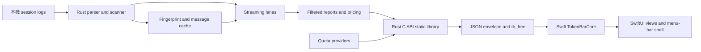
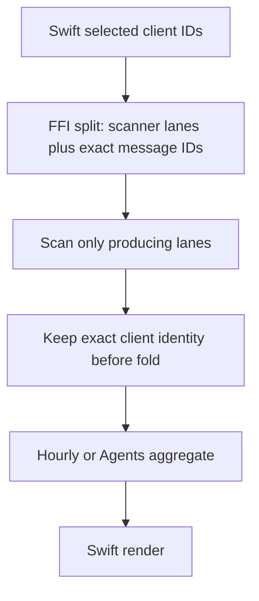

# Runtime architecture and data flow

## 文件目的

這份文件描述 TokenBar native app 的資料 ownership、Rust 到 Swift 的邊界，以及 streaming、cache、pricing、quota 與預聚合報表如何共同形成 UI 可讀的資料。它是架構摘要，不取代 `ctb.h`、FFI 實作或 vendored source code。

## 目錄

- [Ownership map](#ownership-map)
- [FFI data flow](#ffi-data-flow)
- [Windows downstream consumer](#windows-downstream-consumer)
- [Streaming and cache](#streaming-and-cache)
- [Pre-aggregation filters](#pre-aggregation-filters)
- [Pricing and quota boundaries](#pricing-and-quota-boundaries)
- [Swift presentation layer](#swift-presentation-layer)
- [Change checklist](#change-checklist)

---

## Ownership map

| Layer | Source of truth | Responsibility | Must not become |
|---|---|---|---|
| Vendored core | `vendor/tokscale-core/` | Session discovery, parsing, deduplication, pricing, aggregation, and cache-compatible domain values | A wholesale upstream replacement that drops TokenBar patches |
| Rust FFI | `crates/tb_core_ffi/` | Stable C-callable entry points, report options, quota-history sampling and evaluation, panic boundary, JSON serialization, and static-library linkage | A second Swift-side parser or an implicit UI filter |
| C ABI | `Sources/CTB/include/ctb.h` | Function signatures, ownership notes, JSON envelope contract, and `tb_free` declaration | An autogenerated contract whose drift is not reviewed |
| Swift core | `Sources/TokenBarCore/` | Decode FFI payloads and own UI-free calculations such as day bars, grid layout, pace, quota selection, and display formatting | A place to recompute Rust aggregates from raw sessions |
| Swift app | `Sources/TokenBar/` | AppKit menu-bar shell, SwiftUI views, polling lifecycle, settings, and Sparkle integration | A place to silently correct an upstream aggregate after it is already mixed |
| Landing site | `landing/` | Static product presentation and localized copy | A duplicate source for runtime behavior |

## FFI data flow

Rust owns the raw-session interpretation and all expensive aggregation. Swift calls the blocking FFI entry points away from the main actor, decodes the returned heap JSON, and frees the pointer through `tb_free`. Successful calls use `{"ok":true,"data":...}`; failures use `{"ok":false,"err":"..."}`. `tb_probe` keeps its legacy shape for the smoke path.

> **核心不變量：** Rust 產生的 payload 是跨語言契約。Swift 可以格式化、排序或選擇顯示視角，但不能假設自己能從已預聚合的數字反推出每個 client 的貢獻。

## Windows downstream consumer

C ABI 有第二個消費者：Windows port（[Nanako0129/TokenBar-Windows](https://github.com/Nanako0129/TokenBar-Windows)，WinUI 3 + C#）。它以 byte-identical 方式複製本 repo 的 `crates/`＋`vendor/`＋`Sources/CTB/include/ctb.h`，本 repo 是**唯一同步源**；來源 commit 記錄在該 repo 的 `vendor/tokscale-core/SYNC.md`。

| 不變量 | 規則 |
|---|---|
| Sync 方向 | 平台中立或 cfg-gated 的 Windows 修補一律先落在本 repo，再由 Windows 側 re-sync；Windows 側的 local-patch 表以空為目標 |
| `crate-type` | `tb_core_ffi` 的 `["cdylib", "staticlib"]` 兩者都必須保留：cdylib 供 C# P/Invoke（與 Windows repo 在 macOS 上的測試迴圈）載入，staticlib 供 SwiftPM 連結。單獨移除任何一個都會斷一邊 |
| `ctb.h` 簽名 | 簽名變更＝跨 repo breaking change。P/Invoke 綁定沒有編譯期檢查，參數數量錯誤到執行期才以垃圾指標顯現（先例：`tb_hourly_report`/`tb_agents_report` 新增 `clients` 參數）。變更 `ctb.h` 時把 Windows port 視為必須通知的消費者 |
| Build-infra 選型 | vendor 的 reqwest TLS 選型（0.13 `rustls`＝rustls-platform-verifier）部分理由來自 Windows 建置限制（vendored OpenSSL 需 Perl+NASM）；精確帳目在 [`vendor/README.md`](../../vendor/README.md) 的 local-patch 表 |
| 邏輯層對拍 | `Sources/TokenBarCore` 在 Windows 側有 C# 逐檔移植；語意變更後的跨語言驗證見 [`verification.md`](verification.md) |

## Streaming and cache

The local streaming path is a cache-aware, per-file pass. Each client lane parses only the sources selected for the report, applies its own dedup semantics, and feeds report sinks without materializing the entire history into one `Vec`. The materialized APIs remain where they are needed for compatibility, but new report consumers should use the streaming driver when the local implementation provides it.

| Stage | Decision | Why it matters |
|---|---|---|
| Source identity | Fingerprint the source and relevant siblings | A metadata-only rewrite must invalidate a cached parse |
| Change probe | Compare the latest source mtime, including SQLite WAL or parser-specific siblings | A cache hit must not hide a live-tail write |
| Mtime pruning | Keep append-only and SQLite-backed lanes according to their source semantics | Main-file mtime is not sufficient for WAL or sibling updates |
| Message cache | Rebuild when serialized parser output or resume state changes | Cache schema 29 is local to this vendor and must not mirror upstream numbers |
| Report fold | Feed filtered, deduped, priced messages into report-specific sinks | All report consumers need a documented arithmetic and client-set contract |

A parser that reads a secondary file must update all four related seams together: fingerprint, active lane, latest-mtime probe, and mtime pruning. SQLite lanes also probe the WAL. This is the sibling rule captured in [`verification.md`](verification.md) and [`vendor-tokscale.md`](vendor-tokscale.md).

## Pre-aggregation filters

A filter is correct only when it reaches the layer that still has client identity. Graph and model reports can filter at their message or lane boundary. Hourly and Agents reports may otherwise contain mixed buckets that have already combined several clients; a Swift membership test on the final bucket cannot subtract one client from that total.

`TBCore.withYearAndClients` passes a non-empty client selection through the C ABI to Rust, where the hourly and Agents scans filter before folding mixed buckets. The `ctb.h` contract defines `nil` or an empty client list as all clients. The all-hidden case is rejected by the Swift lens's strict membership view rather than encoded as an empty FFI deny-list.

Dynamic IDs need explicit vocabulary handling. For example, `cc-mirror/*` is a produced message ID rather than a scanner lane, so the request expands to the producing Claude lane and retains only the exact requested IDs at the fold gate. Canonical IDs, trace IDs, aliases, and quota aliases must not be conflated by a generic suffix strip.

> **預聚合警告：** 「隱藏 client 等於不存在」不能靠 view 層過濾完成。對 `TBCore.withYearAndClients` 對應的 hourly／Agents 報表，non-empty partial selection 必須在 Rust fold 前排除未選 client；`ctb.h` 的 `nil`／empty clients 明定為 all clients。all-hidden 狀態由 Swift lens 的 strict membership 阻擋。若要改變 empty semantics，必須同步遷移 Swift、C ABI、Rust 與 tests。

## Pricing and quota boundaries

Pricing and quota are separate flows. Vendored tokscale pricing resolves model cost and cache rates for parsed messages; the FFI quota modules fetch provider windows and return a quota payload. A quota card does not imply that the provider stores local token history, and a local parser does not imply that a provider quota endpoint is available.

| Data | Computed by | Swift expectation |
|---|---|---|
| Token counts, model cost, active days | Rust core and FFI reports | Decode and display; do not reprice raw sessions |
| Price freshness | Vendored pricing service | Show the timestamp supplied by the model report |
| OAuth or subscription windows | Rust FFI provider modules | Preserve last good data when refresh fails and display an actionable error only when no good value exists |
| Tray quota selection | Swift `QuotaResolver` | Select from already decoded windows; do not make a second provider request |
| Linear pace projections | Swift `TokenBarCore` | Derive elapsed／duration fallback from the current provider window |
| Codex Weekly historical pace | Rust FFI v2 history evaluator | Decode one optional nested expected／ETA／will-last／risk result; derive display stage only, and use Linear when absent |

Authoritative provider-reported costs use the vendored cost-provenance contract. The local cache schema must be bumped whenever serialized message output changes, while report-time-only arithmetic changes do not require a cache bump.

Codex Weekly history uses the dedicated `codex-weekly-history-v2.json` store. Rust normalizes and validates raw quota samples, admits only complete account-scoped weeks, and owns the coherent historical projection. The legacy v1 file is not a migration input and remains untouched; during the v2 learning period, Swift receives no historical result and uses the Linear calculation.

Pricing metadata is refreshable rather than frozen for the process lifetime; the current refresh cadence is approximately one hour. When provider-hinted lookup selects an entry without cache rates, local cache-rate backfill preserves the correct cache pricing.

## Swift presentation layer

SwiftUI owns the six dashboard lenses, settings, menu-bar title, quota icon, animation, and lifecycle of the popover and settings window. `DashboardModel` coordinates initial load, lazy hourly and Agents reports, year selection, snapshot reuse, stale-data retention, and poll cancellation. The app shell must stop hidden-window polling when the window is closed; otherwise an apparently idle menu-bar utility can keep rendering and consuming CPU.

`Package.swift` links the Rust static library from `target/release`, so the build must run from the repository root after Rust has produced the library. The Makefile is the local build-order source and contains the stale-executable relink guard for SwiftPM's incomplete static-library dependency tracking.

## Change checklist

| Question | Evidence required |
|---|---|
| Does the change alter parsed messages, dedup keys, agent attribution, or cost provenance? | Hermetic old-fail/new-pass fixture and an intentional cache-schema decision |
| Does the change cross Rust, C, and Swift? | `ctb.h`, FFI mapper, Swift decoder, nested payload parity test or smoke evidence, and downstream Windows handoff |
| Does a report hide or select clients? | Source-to-consumer matrix, ID vocabulary check, and pre-aggregation filter test |
| Does a parser read siblings or WAL? | Fingerprint, lane, mtime, and pruning coverage |
| Does a UI lifecycle change start or stop polling? | Closed-window CPU/render evidence and cancellation regression |
