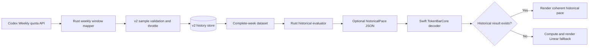

# Codex historical pace v2 clean-start plan

## 文件目的

這份計畫修正 Codex Weekly historical pace 會因不穩定的 reset timestamp 與不完整歷史群組而錯誤顯示 `Lasts until reset` 的問題。實作採用新的 v2 history store，完全不讀取、改寫或刪除既有 v1 history；所有使用者從乾淨資料重新學習，資料不足時自動使用 Linear pace。

> **已鎖定決策：** v1 不做 migration。v2 只從新版收集的可信 raw samples 建立 historical curve；舊檔保留作為 rollback 與診斷材料，但不再影響新版本的計算。

## 目錄

- [目標](#目標)
- [範圍](#範圍)
- [設計決策](#設計決策)
- [Frozen evaluator and recovery contract](#frozen-evaluator-and-recovery-contract)
- [Target data flow](#target-data-flow)
- [執行階段](#執行階段)
- [驗收條件](#驗收條件)
- [交付與驗證](#交付與驗證)
- [Rollout and rollback](#rollout-and-rollback)
- [風險與相依](#風險與相依)
- [Implementation checkpoint](#implementation-checkpoint)
- [Compact handoff](#compact-handoff)

---

## 目標

新版必須讓 historical expected usage、run-out probability、ETA 與 `willLastToReset` 由同一個 Rust evaluator 產生，避免 Rust 提供歷史風險、Swift 卻用 Linear burn rate 重算 ETA 的 split-brain 行為。當可信完整週不足時，Swift 應收到沒有 historical result 的明確狀態，並沿用現有 Linear fallback。

完成後，reset timestamp jitter、floating zero window 或只有單一 sample 的過期 reset 不得建立假完整週，也不得讓 `0%` historical run-out risk 強制覆蓋當週已明顯超速的 Linear 訊號。

## 範圍

| 類別 | 本次包含 | 本次不包含 |
|---|---|---|
| History store | 新 v2 filename、schema version、atomic persistence、retention、in-process serialization | 讀取、轉換、刪除或 compact v1 history |
| Sample quality | reset normalization、write throttle、dedupe、floating-zero fail-closed、完整週 coverage | 嘗試推測不穩定 v1 reset 原本屬於哪一週 |
| Evaluator | CodexBar live-history curve reconstruction、recency weighting、current-usage alignment、run-out ETA | OpenAI dashboard daily breakdown backfill |
| Cross-language contract | Rust 回傳完整 optional historical result，Swift decode、fallback 與 render | 新增 C function 或改變 FFI heap ownership |
| Cross-port contract | 跑完整 116-case baseline；非 historical cases 必須維持 parity，舊 scalar historical cases 的預期差異要逐案列出並交付 nested fixture／port handoff | 未經另行授權修改或整合 TokenBar-Windows，或為了讓舊 fixture 變綠而保留 split-brain decoder |
| Account scope | 保留 identified account 隔離；不明 owner fail closed | 完整移植 CodexBar managed-account、dashboard attachment 與 legacy alias subsystem |
| UX | 修正 pace／ETA／risk 的一致性，資料不足時使用 Linear | 新增 history 管理 UI 或逐字複製 CodexBar 文案 |
| Release | 準備可驗證行為與使用者說明 | Push、PR、merge、tag、appcast 或 Homebrew 發布 |

TokenBar 的本機 token 與 cost history 不代表 OpenAI subscription quota units，不能用來重建 Weekly quota percent。沒有可信 quota sample 的過去區段維持未知，不用估算值填補。

## 設計決策

| Decision | Locked behavior | Rationale |
|---|---|---|
| Store identity | 新檔名使用 `codex-weekly-history-v2.json`，內容帶明確 schema version | 讓 clean start 與 v1 完全隔離，避免隱式 migration |
| Legacy handling | v1 檔案不讀、不寫、不 rename、不刪除 | 保留 rollback／診斷能力，並把舊資料錯誤排除在新 runtime 外 |
| Corrupt recovery | 無法 decode 或 schema 不符時，先把 v2 原檔同目錄 quarantine；成功後才從空 v2 繼續，quarantine 失敗則本次完全不寫 | 同時保留原始證據並讓後續 learning 有明確恢復路徑 |
| Store owner | Rust 繼續擁有 sampling、account scope、persistence 與 evaluator | Live quota、stable account identifier 與現有 history path 都在 Rust；搬到 Swift 會新增第二個 ownership seam |
| FFI shape | `UsageWindow` 改為 optional nested `historicalPace`，不再傳兩個彼此不足的 scalar | Historical expected、ETA、will-last 與 risk 必須是同一次 evaluator 的一致結果 |
| Linear fallback | `historicalPace == nil` 時由 Swift 使用既有 Linear calculation | 不足 3 個完整週不是錯誤，也不能假裝已有 historical confidence |
| Sampling cadence | reset 先 round 到 5 分鐘，再套 30 分鐘／1 percentage-point write threshold | 對齊 CodexBar 的 bounded live-history cadence，避免 reset jitter 繞過 throttle |
| Complete week | Dedupe 後至少 6 筆，window 開始後 24 小時與 reset 前 24 小時都有 coverage | 避免單筆、局部或滑動 reset fragment 被當成完整週 |
| Historical threshold | 3 個完整週才產生 historical pace；5 個完整週才公開 run-out probability | 對齊 CodexBar 的 confidence boundary |
| Evaluator baseline | Store cadence 對齊 CodexBar `4abfbb6c`；evaluator 以 `f986661480c7862bc42b09ad37e5dc781a7353d3` 為基準，但 historical expectation 允許高於 linear baseline | 個人歷史曲線負責描述實際節奏；quota safety 由獨立 risk／ETA evaluator 判斷，避免前期集中但整週安全的使用模式被誤標為超前 |
| Retention | 保留 56 天 v2 samples | 容納最多約 8 週，同時限制檔案成長 |
| Backfill | 第一版不實作 dashboard backfill | TokenBar 沒有相應 dashboard auth、daily breakdown 與 account-authority contract |
| Cache schema | 不變更 vendored message cache schema | 這是獨立 quota-history store 與 FFI presentation payload，不改 parser serialized output |

Floating-zero fixture 的最低要求是：當 `usedPercent == 0` 且 reset horizon 持續跟著 sample time 滑動時，這些 readings 不得形成可評估的 historical week。v2 固定不持久化 zero readings，但仍可用既有完整週評估當下的 `0%`；不能靠增大 reset bucket 掩蓋問題。

## Frozen evaluator and recovery contract

### Store sequencing

| Step | Locked behavior |
|---|---|
| Account gate | `account_id` 優先，其次是 email；兩者皆無時跳過 record 與 evaluate，不建立或載入 identified history |
| Normalize | reset 先 round 到最近的 300 秒，再進入 throttle、dedupe、grouping 與 evaluator scope |
| Validate | 只持久化 finite、`0 < usedPercent <= 100`，且 sample time 落在 `[reset - duration, reset]` 的 readings |
| Throttle | 同 account／window 的最近 reading 只有在 normalized reset 改變、相隔至少 1,800 秒或用量改變至少 1 percentage point 時接受 |
| Dedupe | 同 account／normalized reset／window／30-minute sample bucket 最多保留一筆；先 dedupe，再計算 sample count 與 boundary coverage |
| Serialize | 一個 process-local mutex 包住完整 load → quarantine／record → atomic save → evaluate read-modify-write cycle |
| Atomic save | 同目錄以 unique `create_new` temp file 寫入、flush／sync，再 rename 到正式 v2 path；rename 失敗時保留既有正式檔並清除 temp |
| Retention | 以 `sampledAt` 保留最近 56 天；schema version 固定為 `2` |

讀取 v2 時若 bytes 無法 decode 或 schema version 不是 `2`，以評估時的 Unix seconds 建立 `codex-weekly-history-v2.corrupt-<seconds>.json`；若名稱已存在，依序使用 `.1`、`.2`。只有同目錄 rename 成功後，該 refresh 才能從空 store record 並 atomic save 新 v2；rename 或後續 save 失敗時回傳沒有 historical result，不得覆寫或刪除 quarantine。測試必須逐 byte 比對 quarantine、證明新 v2 可 reload，並證明下一個有效 cycle 能繼續累積。

### Evaluator order

| Step | Formula or invariant |
|---|---|
| Complete weeks | 只取同 account／window、`reset <= now` 且 reset 早於 current normalized reset 的週；至少 6 個 deduped samples，且 window 開始後 24 小時與 reset 前 24 小時各有 coverage |
| Week curve | 依 elapsed fraction 排序，先做 cumulative max，再補 `(0, 0)` 與 `(1, last)`，線性插值到 169 點，最後 clamp `0...100` 並再次 monotonicize |
| Confidence | 少於 3 個 complete weeks 不產生 result；5 個 complete weeks 才一般性公開 risk |
| Recency | `weight = exp(-ageWeeks / 3)`；`nEff = sum(weight)^2 / sum(weight^2)`；`lambda = clamp((nEff - 2) / 6, 0, 1)` |
| Expected curve | 每格取 recency-weighted median，再算 `lambda * historical + (1 - lambda) * linear`；結果 clamp 到 `0...100` 後 monotonicize，不以 linear baseline 作上限 |
| Capped demand | 歷史 curve 第一次到 100% 後，以 `slope = valueAtCap / uAtCap` 延伸其未截斷 demand，再進行 current shift 與 crossing search |
| Current shift | 每週以 `shift = actual - curve(uNow)` 對齊當週已發生用量；shifted end 未 clamp，`>= 100` 計為 run-out |
| Risk | `smoothed = clamp((weightedRunOutMass + 0.5) / (totalWeight + 1), 0, 1)`；一般情況只有 5+ 週輸出，3–4 週維持 `nil` |
| ETA and lasts | `willLastToReset = smoothed < 0.5`；需要 crossing 時，以 first-crossing 線性插值後取 recency-weighted median ETA |
| Exhausted override | 已有 historical result 且 current actual `>= 100` 時，強制 `etaSeconds = 0`、`willLastToReset = false`、`runOutProbability = 1`，覆蓋 5-week risk threshold；少於 3 週仍走 Linear fallback |

`etaSeconds` 的原點是本次 evaluator 的 `now`，單位為 seconds，表示距離 shifted curve 首次到 100% 的時間。Historical result 中 `etaSeconds == nil` 等價於 `willLastToReset == true`；`willLastToReset == false` 必須有 non-negative ETA。若 crossing candidates 為空，evaluator 必須改判會撐到 reset，而不是產生 `false + nil`。

## Target data flow



`historicalPace` 包含下列欄位；命名以 Swift camelCase payload contract 為準。

| Field | Type | Ownership |
|---|---|---|
| `expectedUsedPercent` | `Double` | Rust historical curve |
| `etaSeconds` | optional `Double` | Rust shifted-curve crossing |
| `willLastToReset` | `Bool` | Rust historical projection |
| `runOutProbability` | optional `Double` | Rust；一般情況至少 5 個完整週，exhausted override 為 `1` |

Swift 可以用 `actual - expected` 計算現有 pace stage 與顯示文字，但不得在 historical mode 重新推導 ETA 或覆寫 `willLastToReset`。Risk label 也必須讀取同一份 `historicalPace`，不能再從 `UsageWindow` 的獨立 scalar 取得。

## 執行階段

| Stage | Primary files | Work | Exit gate |
|---|---|---|---|
| 0. Freeze fixtures | `crates/tb_core_ffi/src/agent_history.rs` or dedicated test module | 建立 reset jitter、floating zero、不完整週、current-usage alignment 與 exhausted quota fixtures | Fixtures 能證明舊 evaluator 會產生假週或錯誤 lasts 結果 |
| 1. Introduce v2 store | `crates/tb_core_ffi/src/agent_history.rs`、`crates/tb_core_ffi/src/agent_usage.rs` | 新 filename/schema、account fail-closed、normalized write key、dedupe、coverage、56-day retention、corrupt quarantine、atomic write 與 serialization guard | v1 sentinel bytes／mtime 不變；unknown owner 不碰 store；v2 可 record、reload、recover、prune |
| 2. Port evaluator | `crates/tb_core_ffi/src/agent_history.rs` | 169-point monotonic curves、recency weighting、Linear baseline blend、capped-curve extension、current-actual shift、weighted risk／ETA | Rust fixtures 對齊 public CodexBar worked cases |
| 3. Replace payload seam | `crates/tb_core_ffi/src/agent_usage.rs`、`Sources/CTB/include/ctb.h`、`Sources/TokenBarCore/AgentUsage.swift` | 用 nested `historicalPace` 取代 top-level historical scalars，並更新 payload contract comment；C function 與 envelope 不變 | Rust JSON fixture 能由 Swift decode；缺欄位仍走 Linear |
| 4. Make presentation coherent | `Sources/TokenBarCore/UsagePace.swift`、`Sources/TokenBar/Views/AgentLimitsCard.swift`、selftest fixtures | Historical mode 接受 Rust ETA／will-last／risk，Linear mode 維持現況 | 不再出現 evaluator 判定會耗盡但 UI 顯示 `Lasts until reset` |
| 5. Complete handoff | Relevant canonical docs、release notes、`Sources/CrossCheckHarness/main.swift` if required | 更新 durable behavior、驗證證據與 rollout caveat；跑完整 116-case baseline，區分 intended historical mismatch 與 unrelated regression，並交付 nested fixture／Windows port delta | Docs gate、full code gate、非 historical cross-check 與 diff review 完成；未取得跨 repo 授權前不修改 Windows 或宣稱新 historical parity，停在 integration authorization 前 |

每個 Stage 完成後都應保留單一 concern 的 checkpoint。若 Stage 1 無法證明 v1 完全未被碰觸，或 Stage 3 仍讓 Rust 與 Swift 各自判斷 historical run-out，應停止而不是繼續疊加 UI workaround。

## 驗收條件

### Store and sampling

| Case | Required result |
|---|---|
| Existing v1 file | 新版 refresh 後 bytes、mtime 與 pathname 均不變 |
| First v2 launch | 建立或載入 v2；沒有 historical result，UI 使用 Linear |
| Reset jitter | 同一 reset 的秒／分鐘 jitter 收斂到同一 5-minute key，且不能繞過 write throttle |
| Duplicate cadence | Normalize 後重複 readings 不得灌出假的 6-sample complete week |
| Floating zero | Sliding full-window reset 不得產生 completed week 或 historical result |
| Partial history | 只有中段 samples、只有 start、只有 end 或單筆過期 reset 都不計入 dataset |
| Future reset fragment | 即使 sample count 與 start／end coverage 已成立，只要該 group 的 normalized reset 尚晚於 `now` 就不計入 dataset |
| Complete history | Dedupe 後至少 6 筆，且 start／end coverage 皆成立時才建立 week profile |
| Account isolation | Account A 的 samples 不得出現在 Account B dataset；unidentified owner 不得 record、evaluate、建立 v2 或接管 identified history |
| Corrupt v2 | 原始 bytes quarantine 後仍完全相同；成功 quarantine 可建立並 reload 新 v2，quarantine 失敗則正式 path 與原始 bytes 均不變 |
| Concurrent refresh | 同 process 的 read-modify-write 被序列化，不產生截斷或 lost update |

### Evaluator

| Case | Required result |
|---|---|
| 0–2 complete weeks | `historicalPace == nil` |
| 3–4 complete weeks | Historical expected／ETA 可用，`runOutProbability == nil` |
| 5+ complete weeks | 提供 bounded、smoothed run-out probability |
| Monotonic curve | Reconstructed expected usage 不隨 elapsed fraction 下降 |
| Current actual ahead of history | 歷史曲線依 current actual 平移；run-out 與 ETA 反映本週已發生的超額消耗 |
| Historically capped week | 100% plateau 先延伸為未截斷 demand，再計算 future crossing |
| Current actual 100% | 3+ complete weeks 時 `etaSeconds == 0`、`willLastToReset == false`、risk 為 100%；0–2 週仍無 historical result |
| Invalid window | Missing／expired reset、non-positive duration 或 reset 超出 duration 時不產生 historical result |

### Cross-language and UX

| Case | Required result |
|---|---|
| JSON contract | Rust optional／null fields 由 Swift 正確 decode，`ctb.h` 不再宣稱不正確的舊 field-for-field shape，舊 top-level scalar 不再是 source of truth |
| Historical mode | UI 使用同一個 Rust result 的 expected、ETA、will-last 與 risk |
| Linear mode | 行為維持既有 elapsed／duration calculation |
| Learning period | 使用者不需清檔；Historical setting 在資料不足時安靜 fallback Linear |
| Deficit projection | 不顯示彼此矛盾的 deficit、run-out risk 與 `Lasts until reset` 組合 |
| Visible risk while lasting | `willLastToReset == true` 但公開 risk 四捨五入後大於 0 時，右側顯示 risk，不顯示 `Lasts until reset` |
| Other providers | Claude、Copilot、Antigravity、Grok 等沒有 historical result 的 quota windows 不變 |
| Cross-port | 完整 baseline 已執行；非 historical cases 全部無回歸，舊 scalar historical cases 的 intended mismatch 有 exact case list；nested wire cases 在 Windows 未移植前列為未完成 downstream parity，不宣稱已對拍 |

## 交付與驗證

先以 Rust hermetic fixtures 證明 store 與 evaluator，再驗證 JSON payload、Swift selftest 與 UI-free text cases。Live provider refresh 只能作為常見路徑 smoke，不得取代 floating-zero、complete-week 與 shifted-run-out fixtures。

| Evidence | Minimum proof |
|---|---|
| Old-fail/new-pass | Exact reset grouping 或 old probability override 在 synthetic fixture 重現錯誤；v2 path 收斂到預期 |
| Legacy isolation | Temporary v1 sentinel file 在完整 record/evaluate cycle 後未改變 |
| Persistence | Atomic v2 save、reload、retention、corrupt quarantine／recovery 與 concurrent writer tests |
| Evaluator behavior | 以 pinned CodexBar revisions 覆蓋 reset jitter、early exhaustion、current actual shift、risk smoothing 與 100% cases；另以 front-loaded quota-safe history 證明 expected 可高於 linear，而 will-last／risk 仍由獨立 evaluator 決定 |
| FFI parity | Rust serialized fixture、Swift decode fixture 與 missing historical result fallback |
| Presentation | Selftest 覆蓋 `Projected empty now`、projected empty countdown、lasts、risk absent／present 與 Linear fallback |
| Cross-port | 依 [`../verification.md`](../verification.md) 執行完整 baseline，證明 mismatch 只落在被取代的 historical scalar cases；另交付 nested `historicalPace` fixture 與 C# DTO／UsagePace semantic delta，不在本 repo 偽造 Windows PASS |
| Repository hygiene | Canonical docs、relative links、privacy scan、format 與 full diff review |

Runtime 實作完成後，從 repository root 執行完整 code-change gate：

```bash
cargo fmt --all -- --check
cargo test
cargo clippy --workspace --all-targets
make build
swift run TokenBar --selftest
swift run TokenBar --smoke
```

Canonical docs 變更另執行：

```bash
python3 scripts/check_knowledge.py --self-test
python3 -m py_compile scripts/check_knowledge.py
python3 scripts/check_knowledge.py
make check-docs
git diff --check origin/main...HEAD
```

> **授權邊界：** 完成 plan 或通過全部 gates 都不代表可以 push、開 PR、merge、tag 或 release；integration 必須另行取得使用者授權。

## Rollout and rollback

| Scenario | Behavior |
|---|---|
| Upgrade from any v1 history | 新版忽略 v1 並從 v2 clean start；使用者不需手動清理 |
| Before 3 complete weeks | Historical setting 顯示 Linear fallback；release note 必須明確說明 learning period |
| v2 reaches confidence gate | Historical result 自動出現，不需要 restart 或設定切換 |
| Roll back to an older app | 舊版仍可能讀到保留的 v1 並重現已知錯誤；回退時應暫時選擇 Linear |
| v2 corruption | 先同目錄 quarantine 原始 artifact；成功才建立乾淨 v2 並 fallback Linear，rename 失敗則本次不寫 |
| Future legacy cleanup | 刪除 v1 或新增 Reset learned history 必須是獨立、明確授權的 follow-up |

Release communication 應說明「歷史學習會重新開始」與「資料不足期間使用 Linear」，不要宣稱舊 history 已被 migrated、repaired 或 deleted。

## 風險與相依

| Risk or dependency | Impact | Mitigation |
|---|---|---|
| No dashboard backfill | Historical mode 需要約 3–4 週才能重新啟用 | 明確 Linear fallback 與 release note；不以不可信資料縮短等待 |
| Reset semantics change again | 新資料可能仍無法形成完整週 | Fail closed coverage gate；保留 provider-shaped fixtures 並監看 public API behavior |
| Cross-language split remains | UI 可能再次產生 contradictory projection | Rust 回完整 historical result；Swift test 禁止 historical ETA 重算 |
| Bucket dedupe inflates coverage | 重複 samples 可能假裝完整週 | 先 normalize，再以 sample cadence dedupe，最後才計算 count／coverage |
| Raw account fallback | Unidentified history 可能被不同登入共用 | `default`／unidentified owner fail closed，不與 identified keys 合併 |
| Non-atomic or concurrent writes | v2 可能截斷或遺失 samples | Atomic replace 加 process-local serialization；failure fixture 保留原檔 |
| Literal CodexBar parity expands scope | Dashboard auth、authority 與 managed accounts 會把 correctness fix 變成大型 feature | 本 plan 只鎖 live-history core parity；backfill 另案決策 |
| Downgrade reads v1 | Rollback 可能重現舊 `Lasts until reset` | 保留已知 rollback caveat；必要時手動 Linear，不在本次變更 v1 |
| Downstream Windows drift | Native nested DTO 與 historical semantics 先改變，C# port 尚未同步 | 跑完整 baseline 並要求非 historical cases 維持綠燈；final handoff 列出 intended mismatch、新 wire fixture 與 port delta，另行授權跨 repo 實作後才宣稱 historical parity |

## Implementation checkpoint

Historical pace v2 已在本 repository 的 Rust、C header 與 Swift surface 完成。實作保留 v1、導入 clean-start v2 store，並把 expected、ETA、will-last 與 risk 收斂成 Rust 產生的單一 nested result；Swift 在結果缺席時維持 Linear fallback。

| Surface | Evidence | Status |
|---|---|---|
| Rust store and evaluator | `agent_history` 15 tests、`agent_usage` 17 tests 與 workspace 1,133 executed tests 通過；另有 1 個既有 ignored test | Complete |
| Rust lint and scoped formatting | `cargo clippy --workspace --all-targets` 零 warning；`agent_history.rs` 通過 `rustfmt --check`，`agent_usage.rs` 只保留契約相關 semantic diff | Complete |
| Repository-wide formatting | `cargo fmt --all -- --check` 仍在既有 Rust／vendor formatting baseline 回報 delta；本變更未把該批無關 reflow 納入 diff | Baseline follow-up |
| Swift core and ABI | `TokenBarCore` build、直接 typecheck、nested payload runtime fixture 與 `ctb.h` syntax check 通過；cross-check harness 成功編譯 | Complete |
| Full app gate | Rust release build 通過；2026-07-16 重跑 Swift app build 時，本機 Command Line Tools 的 compiler `6.3.3` 與 SDK module `6.3.2` 不相容，`--selftest` 與 `--smoke` 因 manifest 無法編譯而未執行，需由相容 toolchain／CI 完成 | Pending compatible-toolchain rerun |
| Cross-port baseline | 116 cases 已執行；非 historical cases 全數一致，9 個 legacy scalar historical cases 共有 27 個 intended field differences | Native complete; Windows handoff pending |

Legacy baseline 的 exact mismatch case IDs 如下；它們仍以被移除的 top-level scalar contract 驅動 C#，所以不能為了讓舊 baseline 全綠而恢復 split-brain decoder。

```text
historical-expected-clamped
historical-runout-exact-half
historical-runout-high-keeps-eta
historical-runout-low-forces-lasts
historical-with-expected
runout-risk-certain
runout-risk-clamped-above-one
runout-risk-half-percent-rounds-up
runout-risk-thirty
```

Windows downstream 的下一步是新增 nested `historicalPace` DTO／wire fixtures，讓 Historical mode 直接接受 backend ETA、`willLastToReset` 與 risk，並保留缺席時的 Linear fallback。完成該 port 並重跑對拍前，只有非 historical baseline parity 已被證明。

## Compact handoff

下一個 session 應先讀 [`../README.md`](../README.md)、[`../architecture.md`](../architecture.md)、[`../verification.md`](../verification.md) 與本計畫，review 本 checkpoint 的 exact diff，並在相容 Swift toolchain 重跑完整 app build、selftest 與 smoke。不要重做 v1 migration、dashboard backfill 或恢復 top-level historical scalars。

本 plan 不自行授權 integration；執行仍依 [`../workflow.md`](../workflow.md) 與當次使用者指令。Windows repo 不在本次寫入 scope；後續 port 必須依上方 nested DTO／semantic delta 新增 fixture，再宣稱 historical cross-port parity。若 review 改變 frozen evaluator contract，先同步更新本文件與 Rust fixtures，不在 presentation layer 補 workaround。
