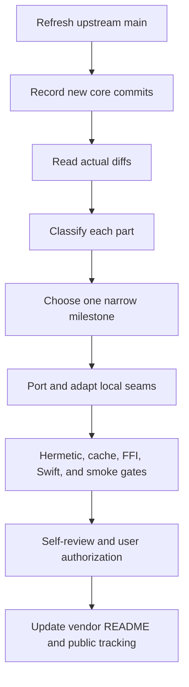

# Rolling tokscale alignment plan

## 文件目的

TokenBar follows upstream `tokscale` as a rolling source and selects correctness work one bounded milestone at a time. This plan is the concise handoff surface; exact commit rows and local patch details stay in [`vendor/README.md`](../../../vendor/README.md).

## Current ordering

| Workstream | Status | Rule |
|---|---|---|
| Public inventory | active | Keep issue #45 current; inventory does not imply an implementation commitment |
| Vendored correctness | priority | Prefer user-reported wrong/missing data, cache invalidation, and cross-language contract fixes |
| Copilot upstream follow-up | assessment complete; locally equivalent | Issue #879 is closed and PR #880 is merged; the exact merged diff matches the local M10-E behavior, so retain the equivalence record without another code or schema port |
| New client breadth | deferred | Requires an explicit product decision and a complete streaming/cache/FFI adaptation |
| Pricing pipeline expansion | deferred | Do not port a partial routed-pricing behavior without a complete precedence and safety model |

## Milestone protocol

A milestone is complete only when the selected diff is explained, excluded hunks are named, stale-cache behavior is addressed, and the exact vendor ledger is updated. A plan entry never authorizes remote integration by itself.

## Required evidence

| Area | Evidence |
|---|---|
| Baseline | Current upstream ref and current vendor tree, not a stale plan snapshot |
| Fidelity | File-level diff showing the selected hunk and every local adaptation |
| Correctness | Hermetic fixture with a failure mode before the change |
| Cache | Schema decision and same-fingerprint rebuild test when output changes |
| Streaming | Fingerprint, lane, mtime, prune, and materialized/streaming parity checks |
| Boundary | C ABI and Swift decoder updates when report options or payloads change |
| Delivery | No push, PR, merge, tag, or release until separately authorized |
