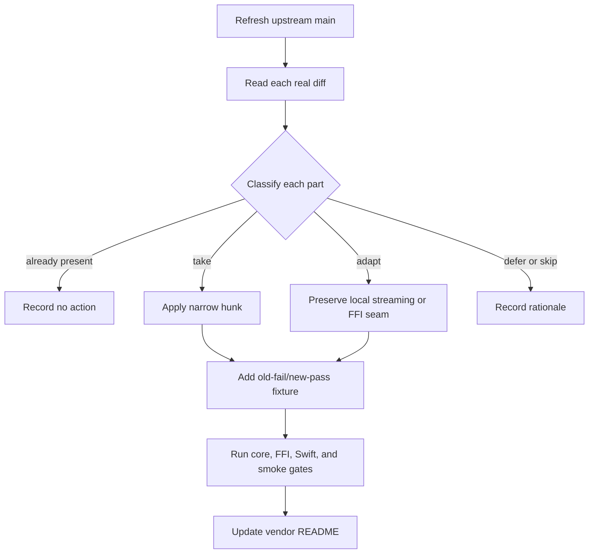

# Vendored tokscale alignment

## 文件目的

TokenBar vendors a selective copy of `tokscale-core`. This document explains the method, boundaries, and invariants that make selective alignment safe. The exact baseline, commit table, local patch table, and upstream report numbers remain exclusively in [`vendor/README.md`](../../vendor/README.md).

## 目錄

- [Current boundary](#current-boundary)
- [Selective-port method](#selective-port-method)
- [Local adaptation families](#local-adaptation-families)
- [Schema and parser output](#schema-and-parser-output)
- [Sibling-source rule](#sibling-source-rule)
- [Upstream alignment](#upstream-alignment)
- [Handoff checklist](#handoff-checklist)

---

## Current boundary

The vendor's true baseline is recorded in `vendor/README.md`; the package version string is not a reliable baseline marker. The current tree contains upstream cherry-picks plus TokenBar-specific streaming, cache, report, FFI, pricing, and defensive adaptations. `vendor/README.md` is the exact source of truth for whether a given commit or local patch is already present.

> **不要整檔 re-vendor。** Upstream does not contain all TokenBar report and streaming work. Replacing a whole `lib.rs`, scanner, cache, sessionize, or aggregator file can silently remove local semantics while still compiling.

## Selective-port method

| Step | Rule |
|---|---|
| Reference | Re-fetch and record the upstream commit being assessed; do not use a stale plan line number as evidence |
| Diff | Read the actual diff, including multipart commits whose title understates runtime changes |
| Port | Apply only the selected hunk to the current vendor tree; use context-aware patching and fail loudly on mismatch |
| Adapt | Keep TokenBar's local streaming lanes, report filters, cache identity, and FFI mapping explicit |
| Verify | Test the parser output, cache rebuild, streaming path, and materialized parity where applicable |
| Record | Update the exact vendor ledger before handing off |

## Local adaptation families

| Family | Contract |
|---|---|
| Streaming reports | `scan_messages_streaming`, per-client dedup sets, `StreamingAggregator`, `SessionizeAccumulator`, and Agents report parity remain local seams |
| Cache | Fingerprints, mtime probes, sibling dependencies, pruning exceptions, schema decisions, and cached attribution rebuilds are local until upstream has the same architecture |
| Pricing | Cache-rate backfill and refreshable pricing are local behavior; upstream cost-provenance ports must not erase them |
| FFI | Report client slices, hourly/Agents filtering, bounded totals, and thin mappers are TokenBar-specific consumers |
| Discovery | Cowork, local client lanes, and platform-specific scanner roots may be local even when the parser originates upstream |
| Defensive fixes | Saturating folds, placeholder-row removal, trace-scoped identity, and malformed-input handling require their own regression evidence |

## Schema and parser output

The vendor owns its cache-schema counter. It is currently schema 28 after selective parser and attribution changes. Do not mirror an upstream schema number merely because the same upstream commit is being ported. Bump the local schema when serialized message fields, parser output, dedup keys, or attribution changes make old cached values semantically stale; do not bump for report-time-only arithmetic changes.

A parser-output change must include a same-fingerprint stale-cache regression. A test that only parses a fresh source does not prove that existing users receive the correction.

## Sibling-source rule

When a parser reads a primary file plus metadata, journal, history, or WAL sibling, treat the sibling as part of the source identity. The four required sites are:

| Site | Required behavior |
|---|---|
| Fingerprint | Include every sibling whose content can change parsed meaning |
| Active lane | Streaming and materialized consumers use the same fingerprint function |
| Mtime probe | Live tail sees sibling-only writes |
| Pruning | Modified-after scans retain sessions when a sibling is newer |

This rule applies to JSONL journals, Roo-family history, SQLite WAL files, Claude parent/workflow transcripts, and other secondary sources. A local adaptation is incomplete when only the parser or only the cache loader changes.

## Upstream alignment

The public rolling inventory is tracked in [issue #45](https://github.com/Nanako0129/TokenBar/issues/45). It is an inventory and decision surface, not a promise to clear every deferred capability. Correctness work is prioritized over new client breadth during maintenance. Every selected item must be re-evaluated against the current upstream head and current vendor tree before implementation.

The Copilot nested-agent bookkeeping in `vendor/README.md` records upstream issue [#879](https://github.com/junhoyeo/tokscale/issues/879) as closed and pull request [#880](https://github.com/junhoyeo/tokscale/pull/880) as merged (upstream commit `20d9096a68a40d4a4e83581b0e0dd308aadc5ab7`; GitHub PR merge commit `b7277d49a14ae905c17195be214d632e365b3ca6`). The exact merged diff has been compared with the local M10-E hardening: its trace-scoped hierarchy and stale-cache rebuild semantics are equivalent, so no additional production or cache-schema port is needed. The assessment therefore closes as bookkeeping-only. This is no longer an external-upstream wait state; do not resurrect the superseded intermediate report when describing that status.

## Handoff checklist

| Question | Evidence |
|---|---|
| Is the selected upstream hunk present in the current vendor? | Exact file-level diff or stable patch comparison |
| Did a local patch get overwritten? | `vendor/README.md` local-patch table and targeted diff |
| Did parser output or attribution change? | Local schema decision plus stale-cache regression |
| Does a sibling source reach all consumers? | Fingerprint, lane, mtime, and prune tests |
| Does FFI expose a pre-aggregation filter? | C header, Rust mapper, Swift decoder, report parity fixture |
| Is the result still selective? | Focused fidelity note explaining included and excluded hunks |
